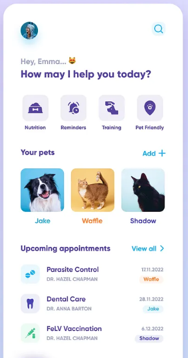
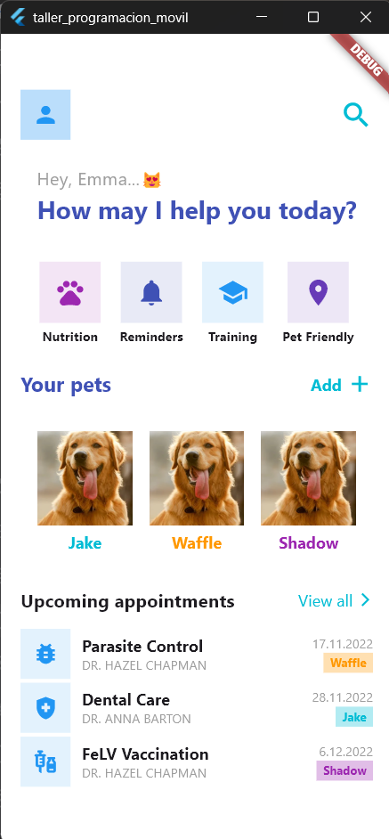

# taller_programacion_movil

Taller sobre realizacion de diseño basico sin funcionalidad, solo guia visual de imagen de ejemplo

## Requerimientos
------
A partir de la imagen de referencia proporcionada, el estudiante deberá desarrollar una réplica visual de la interfaz móvil (UI) utilizando la tecnología de programación móvil trabajada en el curso.

El objetivo es evaluar la capacidad para analizar una interfaz, identificar sus componentes visuales y reproducirla mediante código.

## Elementos que debe replicar
-----
La interfaz deberá incluir visualmente:

-   Avatar del usuario.
-   Botón de búsqueda.
-   Saludo al usuario.
-   Título principal.
-   Cuatro opciones de acceso:
-   -   Nutrition
-   Reminders
-   Training
-   Pet Friendly
-   Sección ****Your pets****.
-   Botón ****Add +****.
-   Tres tarjetas de mascotas:
-   -   Jake
-   Waffle
-   Shadow
-   Sección ****Upcoming appointments****.
-   Botón ****View all****.
-   Tres tarjetas de citas.
-   Iconos, imágenes, textos y elementos decorativos visibles en la referencia.

## Requerimientos de UI
------
-   El estudiante deberá procurar la mayor fidelidad visual posible respecto a la imagen de referencia:
-   Distribución de los elementos.
-   Márgenes y espaciados.
-   Tamaños.
-   Colores.
-   Tipografía.
-   Bordes redondeados.
-   Iconos.
-   Imágenes.
-   Alineación.
-   Jerarquía visual.
-   Proporciones de los componentes.

La pantalla debe poder visualizarse correctamente en un dispositivo o emulador móvil.

## Importante
------
****No se evaluará la funcionalidad de la aplicación.****

Los elementos como botones, tarjetas o iconos ****no necesitan realizar ninguna acción****. La evaluación estará enfocada exclusivamente en la construcción de la ****interfaz gráfica (UI)****.

## Resultado

